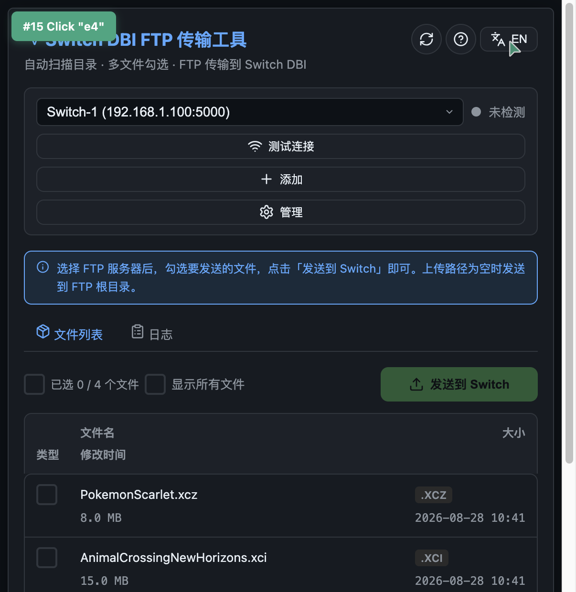
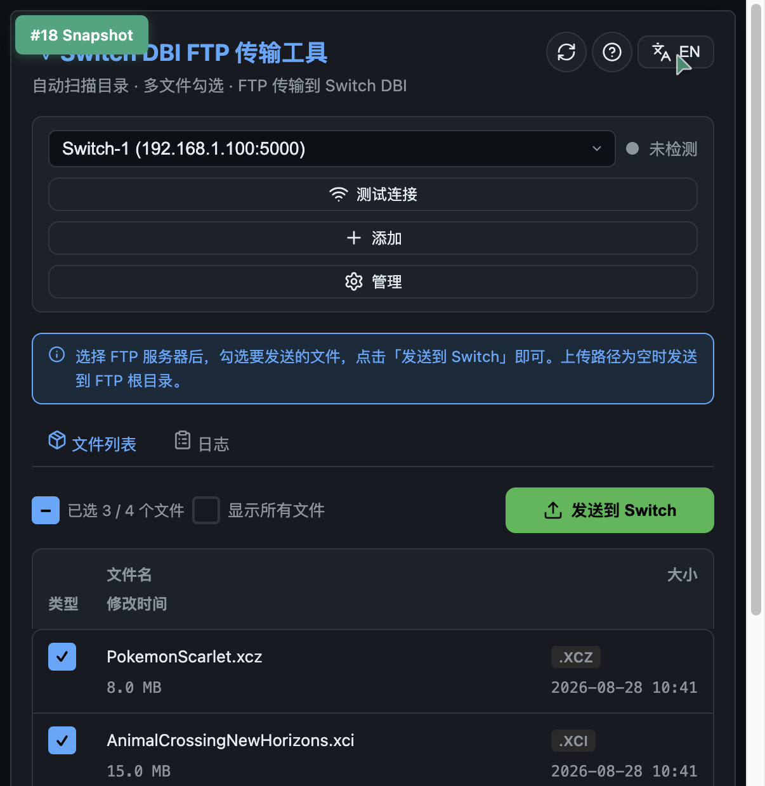
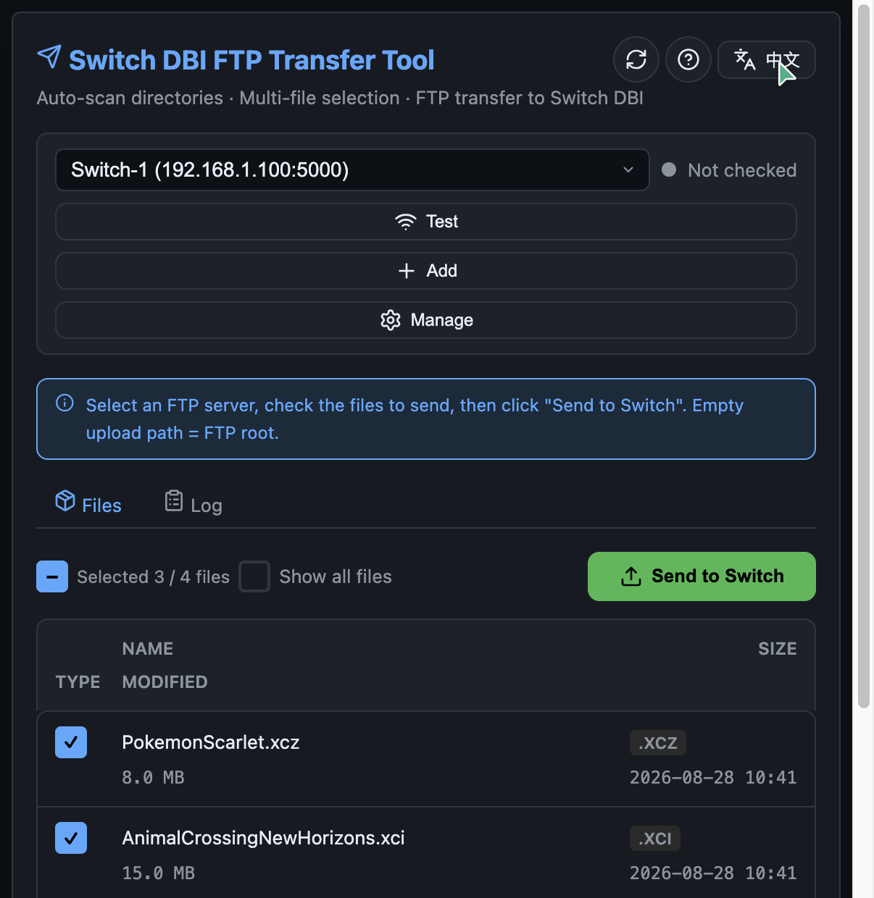
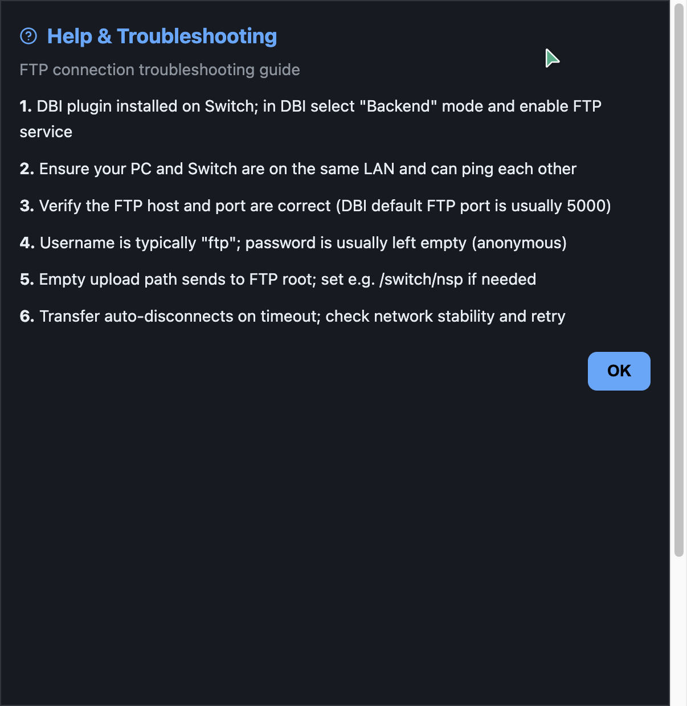
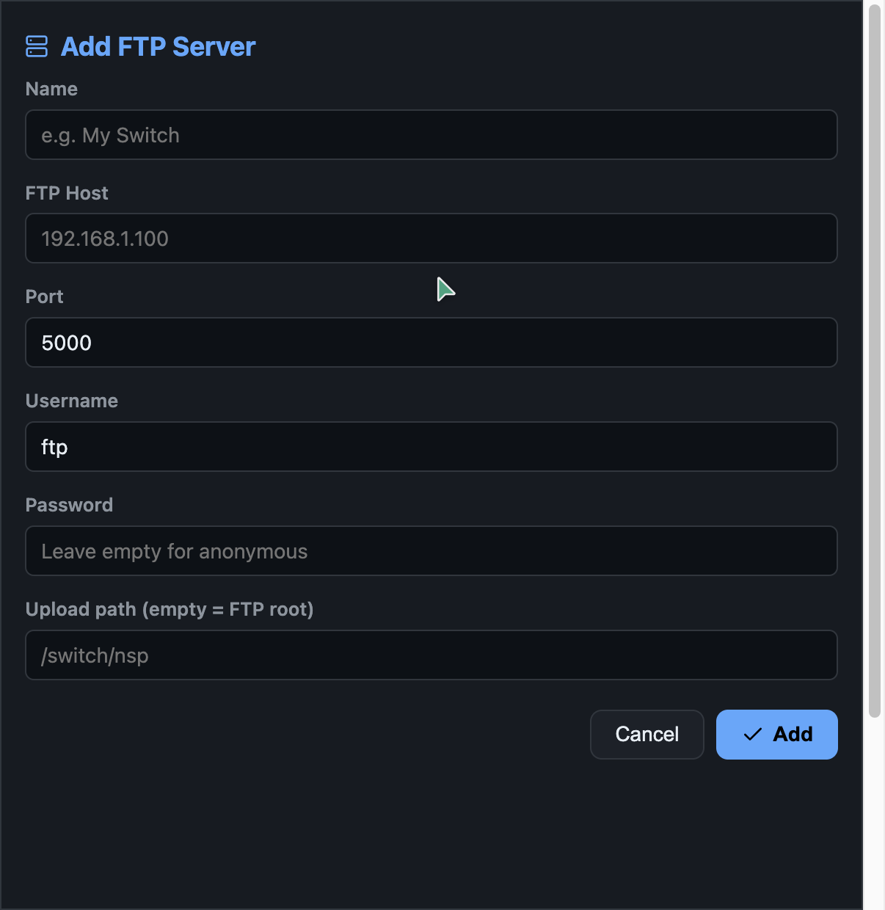

# Switch DBI FTP 传输工具

参照 [ns-web-dbibackend](https://github.com/FallingMY/ns-web-dbibackend) 的页面 UI，用 Python 实现的 Switch DBI FTP 传输服务。

自动扫描目录下的 Switch 安装包（NSP / NSZ / XCI / XCZ），通过列表展示，支持多文件勾选后一键 FTP 发送到 Switch 上的 DBI 后端。

## 页面截图

### 中文主界面



### 勾选文件



### English Interface



### 帮助 & 排查



### 添加 FTP 服务器



## 功能特性

- **自动扫描**：递归遍历配置目录，自动发现所有 Switch 安装包
- **多格式支持**：NSP、NSZ、XCI、XCZ
- **多文件勾选**：列表复选框，支持全选/半选
- **串行上传**：文件逐一上传（并发=1），避免 Switch 端压力
- **FTP 传输**：通过 FTP 协议发送到 Switch DBI 后端
- **多服务器管理**：YML 配置 + 页面手动添加，支持多个 Switch 地址切换
- **连接状态图标**：实时显示 FTP 连接状态（绿色=已连接、红色=失败、灰色=未检测）
- **传输进度**：整体进度百分比 + 单文件进度 + 实时速率 + ETA
- **超时保护**：连接超时 + 传输读写超时 + NOOP 心跳保活
- **中英双语**：右上角一键切换 ZH/EN 全界面语言（含排查指南）
- **Docker 部署**：支持 docker-compose 一键部署
- **响应式布局**：自适应桌面和手机浏览器，文件列表横向滚动不错位
- **关键词搜索**：文件列表实时搜索（不区分大小写）
- **分页显示**：每页 10/15/20 条可选，支持翻页
- **多扫描目录**：页面管理多个扫描路径，支持添加/删除
- **配置持久化**：UI 设置（分页大小、显示所有文件、语言）自动保存到 config.yml

## 快速开始

### 方式一：本地运行

```bash
# 安装依赖
pip3 install -r requirements.txt

# 编辑配置（配置扫描目录和 FTP 服务器）
vim config.yml

# 启动服务
python3 app.py
```

浏览器访问 http://localhost:8090

### 方式二：Docker Compose 部署

```bash
# 1. 将 Switch 安装包放入 games 目录（或修改 docker-compose.yml 中的挂载路径）
mkdir -p games
# cp /path/to/your/*.nsp games/

# 2. 启动容器
docker-compose up -d

# 3. 浏览器访问
# http://localhost:8090

# 查看日志
docker-compose logs -f

# 停止
docker-compose down
```

Docker 部署时，`config.yml` 中的 `scan_dirs` 需配置为容器内路径 `/games`：

```yaml
scan_dirs:
  - /games
```

## 配置说明

### config.yml

```yaml
# 服务监听地址和端口
server:
  host: 0.0.0.0
  port: 8090

# 需要扫描的目录（自动遍历子目录）
scan_dirs:
  - /path/to/switch/games    # 本地运行
  # - /games                  # Docker 运行

# Switch 安装包扩展名
scan_extensions:
  - .nsp
  - .nsz
  - .xci
  - .xcz

# FTP 服务器列表（也可在页面上手动添加/删除）
ftp_servers:
  - name: Switch-1
    host: 192.168.1.100       # Switch 的局域网 IP
    port: 5000                 # DBI FTP 端口
    username: ftp
    password: ""               # 留空为匿名
    upload_path: /switch/nsp   # 上传路径，留空为 FTP 根目录

# UI 设置（页面上修改后自动保存）
ui_settings:
  page_size: 10                # 每页显示文件数（10/15/20）
  show_all_files: false        # 是否显示所有文件（含非安装包）
  language: zh                 # 界面语言（zh/en）
```

### 页面操作

1. **选择 FTP 服务器**：下拉框切换已配置的 Switch 地址
2. **测试连接**：点击「测试连接」查看 FTP 连接状态（图标变色）
3. **添加服务器**：点击「添加」填写 FTP 地址、认证信息、上传路径
4. **管理服务器**：点击「管理」查看/删除已配置的服务器
5. **勾选文件**：在文件列表中勾选要发送的安装包
6. **发送到 Switch**：点击「发送到 Switch」开始 FTP 传输
7. **查看进度**：进度条显示传输百分比、速率、剩余时间
8. **查看日志**：切换到「日志」标签页查看详细传输日志

## API 接口

| 方法 | 路径 | 说明 |
|---|---|---|
| GET | `/` | 主页面 |
| GET | `/api/files` | 获取扫描到的文件列表（?all=true 显示所有文件） |
| POST | `/api/files/scan` | 重新扫描目录 |
| GET | `/api/scan-dirs` | 获取扫描目录列表 |
| POST | `/api/scan-dirs` | 添加扫描目录 |
| DELETE | `/api/scan-dirs?path=<path>` | 删除扫描目录 |
| GET | `/api/ui-settings` | 获取 UI 设置（分页大小、显示所有文件、语言） |
| POST | `/api/ui-settings` | 保存 UI 设置 |
| GET | `/api/servers` | 获取 FTP 服务器列表 |
| POST | `/api/servers` | 添加 FTP 服务器 |
| DELETE | `/api/servers/<name>` | 删除 FTP 服务器 |
| GET | `/api/servers/<name>/status` | 测试 FTP 连接状态 |
| POST | `/api/transfer` | 创建传输任务 |
| GET | `/api/transfer/<id>/status` | 查询传输进度 |
| POST | `/api/transfer/<id>/cancel` | 取消传输 |
| DELETE | `/api/transfer/<id>` | 删除传输任务 |

## 使用前提

1. **Switch 端**：已安装 [DBI](https://github.com/rashevskyv/dbi) 插件
2. **网络**：电脑和 Switch 在同一局域网
3. **DBI 设置**：在 Switch 上打开 DBI，选择「后端 (Backend)」模式，开启 FTP 服务
4. **FTP 端口**：DBI 默认 FTP 端口通常为 5000

## 项目结构

```
ns-webftp-dbi/
├── app.py                # Flask 后端：文件扫描、FTP 传输、API
├── config.yml            # 配置文件：扫描目录、FTP 服务器
├── requirements.txt      # Python 依赖
├── Dockerfile            # Docker 镜像构建
├── docker-compose.yml    # Docker 编排
├── templates/
│   └── index.html        # 前端页面：暗色主题 UI
└── screenshots/          # 页面截图
    ├── main-zh.png       # 中文主界面
    ├── main-en.png       # 英文主界面
    ├── selected-files.png # 勾选文件
    ├── help-modal.png    # 帮助弹窗
    └── add-server-modal.png # 添加服务器弹窗
```

## 技术栈

- **后端**：Python + Flask
- **配置**：PyYAML
- **传输**：ftplib（标准库）
- **前端**：原生 HTML/CSS/JS，Lucide 图标
- **部署**：Docker + docker-compose

## License

MIT
